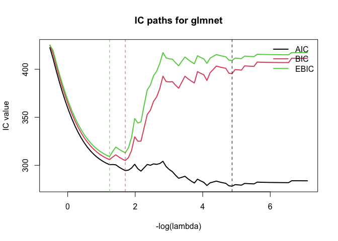

<!-- README.md is generated from README.Rmd. Please edit that file -->

# ICtoolkit

<!-- badges: start -->

[](https://github.com/petersonR/ICtoolkit/actions/workflows/R-CMD-check.yaml)
[](https://app.codecov.io/gh/petersonR/ICtoolkit)
<!-- badges: end -->

ICtoolkit provides a unified interface for computing five information
criteria across four model classes, plus a flexible stepwise selection
function.

| Criterion | Function         | Reference                    |
|-----------|------------------|------------------------------|
| AIC       | `compute_aic()`  | Akaike (1974)                |
| AICc      | `compute_aicc()` | Hurvich & Tsai (1989)        |
| BIC       | `compute_bic()`  | Schwarz (1978)               |
| EBIC      | `compute_ebic()` | Chen & Chen (2008)           |
| RBIC      | `compute_rbic()` | Peterson & Cavanaugh (2026+) |

**Supported model classes:** `lm`, `glm`, `glmnet`, `ncvreg`. For
`glmnet` and `ncvreg`, each criterion returns a vector of length
`length(lambda)` — one value per point on the regularization path.

## Installation

``` r
# Development version from this repository:
devtools::install_github("petersonR/ICtoolkit")

# Or once on CRAN:
install.packages("ICtoolkit")
```

## Quick start

### IC for `lm` / `glm`

``` r
library(ICtoolkit)

fit <- lm(mpg ~ wt + hp + cyl, data = mtcars)
compute_aic(fit)
#> [1] 155.4766
#> attr(,"fit_class")
#> [1] "lm"
#> attr(,"k")
#> [1] 4
#> attr(,"criterion")
#> [1] "AIC"
compute_bic(fit)
#> [1] 162.8053
#> attr(,"fit_class")
#> [1] "lm"
#> attr(,"k")
#> [1] 4
#> attr(,"criterion")
#> [1] "BIC"
compute_ebic(fit, P = 10)   # P = total candidate predictors
#> [1] 165.1744
#> attr(,"fit_class")
#> [1] "lm"
#> attr(,"k")
#> [1] 4
#> attr(,"criterion")
#> [1] "EBIC"
#> attr(,"gamma")
#> [1] 0.247425
#> attr(,"P")
#> [1] 10
```

Results carry informative attributes:

``` r
result <- compute_bic(fit)
attr(result, "fit_class")
#> [1] "lm"
attr(result, "k")
#> [1] 4
attr(result, "criterion")
#> [1] "BIC"
```

### IC over the regularization path (`glmnet`)

``` r
library(glmnet)
#> Loading required package: Matrix
#> Loaded glmnet 4.1-10

n <- 100
p <- 50

set.seed(1)

X <- matrix(rnorm(n * p), n, p,
            dimnames = list(NULL, paste0("x", 1:p)))
y <- X[, 1] * 2 - X[, 3] * 0.25 + rnorm(n)
fit_glmnet <- glmnet(X, y)

# plot_ic_path computes + plots IC paths in one call.
plot_ic_path(fit_glmnet, criteria = c("AIC", "BIC", "EBIC"),
             main = "IC paths for glmnet")
```



### RBIC for grouped predictors

RBIC applies group-specific EBIC penalties — useful when predictors have
a natural structure (e.g., main effects vs. interactions, or different
data modalities):

``` r
P_index <- list(
  main         = c("wt", "hp", "disp"),
  categorical  = c("cyl", "gear", "carb", "am", "vs")
)
compute_rbic(fit, P_index = P_index)
#> [1] 163.708
#> attr(,"fit_class")
#> [1] "lm"
#> attr(,"k")
#> [1] 4
#> attr(,"criterion")
#> [1] "RBIC"
#> attr(,"gamma")
#> [1] 0.1666667
#> attr(,"P_index")
#> attr(,"P_index")$main
#> [1] "wt"   "hp"   "disp"
#> 
#> attr(,"P_index")$categorical
#> [1] "cyl"  "gear" "carb" "am"   "vs"
```

### Stepwise selection with `ic_step()`

`ic_step()` generalises `MASS::stepAIC` to all five criteria:

``` r
fit_null <- lm(mpg ~ 1, data = mtcars)
fit_full <- lm(mpg ~ ., data = mtcars)

selected <- ic_step(
  fit_null,
  scope     = list(lower = fit_null, upper = fit_full),
  direction = "both",
  criterion = "BIC",
  trace     = 0
)
formula(selected)
#> mpg ~ wt + cyl

# The selection path is stored as an attribute
attr(selected, "step_path")
#>   step  action      BIC
#> 1    0 <start> 211.6870
#> 2    1    + wt 170.4266
#> 3    2   + cyl 161.8730
```

This package was developed by Ryan Peterson. Code review,
parallelization, and testing were assisted by Claude (Anthropic).
